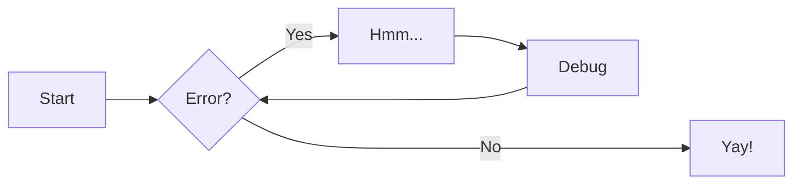

# Examples of blocks for writing documentation

A collection of examples of non-obvious blocks that can be used when writing documentation.


## Admonitions

[docs](https://squidfunk.github.io/mkdocs-material/reference/admonitions/) | [supported types](https://squidfunk.github.io/mkdocs-material/reference/admonitions/#supported-types)

=== "Code"
	```md
	!!! note

		You should note that the title will be automatically capitalized.
	```

=== "Preview"
	!!! note

		You should note that the title will be automatically capitalized.


### inline usage

=== ":octicons-arrow-right-16: inline end"

	!!! info inline end "Lorem ipsum"

		Lorem ipsum dolor sit amet, consectetur adipiscing elit. Nulla et
		euismod nulla. Curabitur feugiat, tortor non consequat finibus, justo
		purus auctor massa, nec semper lorem quam in massa.

	``` markdown
	!!! info inline end "Lorem ipsum"

		Lorem ipsum dolor sit amet, consectetur
		adipiscing elit. Nulla et euismod nulla.
		Curabitur feugiat, tortor non consequat
		finibus, justo purus auctor massa, nec
		semper lorem quam in massa.
	```

	Use `inline end` to align to the right (left for rtl languages).

=== ":octicons-arrow-left-16: inline"

	!!! info inline "Lorem ipsum"

		Lorem ipsum dolor sit amet, consectetur adipiscing elit. Nulla et
		euismod nulla. Curabitur feugiat, tortor non consequat finibus, justo
		purus auctor massa, nec semper lorem quam in massa.

	``` markdown
	!!! info inline "Lorem ipsum"

		Lorem ipsum dolor sit amet, consectetur
		adipiscing elit. Nulla et euismod nulla.
		Curabitur feugiat, tortor non consequat
		finibus, justo purus auctor massa, nec
		semper lorem quam in massa.
	```

	Use `inline` to align to the left (right for rtl languages).


## Collapsible blocks

[docs](https://squidfunk.github.io/mkdocs-material/reference/admonitions/#collapsible-blocks)

```md
???+ note "Open styled details"

	??? danger "Nested details!"
		And more content again.
```

???+ note "Open styled details"

	??? danger "Nested details!"
		And more content again.


## Footnotes

[docs](https://squidfunk.github.io/mkdocs-material/setup/extensions/python-markdown/#footnotes)

```md
Footnotes[^1] have a label[^test-label] and the footnote's content.

[^1]: This is a footnote content.
[^test-label]: A footnote on the label: "test-label".
```

Footnotes[^1] have a label[^test-label] and the footnote's content.

[^1]: This is a footnote content.
[^test-label]: A footnote on the label: "test-label".


## Highlight

[docs](https://squidfunk.github.io/mkdocs-material/setup/extensions/python-markdown-extensions/#highlight)

=== "Code"
	````md
	```console linenums="42" hl_lines="1 4-6"
	$ echo hello world!
	hello world!

	$ git clone git@github.com:dd/Meringue.git
	$ cd Meringue
	$ hatch run docs:serve
	INFO     -  Building documentation...
	INFO     -  Cleaning site directory
	INFO     -  mkdocstrings_handlers: Formatting signatures requires Black to be
				installed.
	INFO     -  Documentation built in 1.96 seconds
	INFO     -  [02:05:37] Watching paths for changes: 'docs/src', 'mkdocs.yml',
				'docs/theme', 'meringue', 'README.md'
	INFO     -  [02:05:37] Serving on http://127.0.0.1:7000/
	```
	````

	````md
	```pycon
	>>> for word in ("Hello", "mkdocstrings!"):
	...     print(word, end=" ")
	...
	Hello mkdocstrings!
	```
	````

=== "Preview"
	```console linenums="42" hl_lines="1 4-6"
	$ echo hello world!
	hello world!

	$ git clone git@github.com:dd/Meringue.git
	$ cd Meringue
	$ hatch run docs:serve
	INFO     -  Building documentation...
	INFO     -  Cleaning site directory
	INFO     -  mkdocstrings_handlers: Formatting signatures requires Black to be
				installed.
	INFO     -  Documentation built in 1.96 seconds
	INFO     -  [02:05:37] Watching paths for changes: 'docs/src', 'mkdocs.yml',
				'docs/theme', 'meringue', 'README.md'
	INFO     -  [02:05:37] Serving on http://127.0.0.1:7000/
	```

	```pycon
	>>> for word in ("Hello", "mkdocstrings!"):
	...     print(word, end=" ")
	...
	Hello mkdocstrings!
	```


### Inline

[docs](https://squidfunk.github.io/mkdocs-material/setup/extensions/python-markdown-extensions/#inlinehilite)

```md
`#!console $ python3 manage.py runserver`
```

`#!console $ python3 manage.py runserver`

```md
`#!python3 import this`
```

`#!python3 import this`


### Annotates

[docs](https://squidfunk.github.io/mkdocs-material/reference/code-blocks/#adding-annotations)

````md
```python
import this # (1)
```

1.  :fontawesome-brands-python: Simple is better than complex.
````

```python
import this # (1)
```

1.  :fontawesome-brands-python: Simple is better than complex.


## Diagrams

[docs](https://squidfunk.github.io/mkdocs-material/reference/diagrams/)

````md

````


## Content tabs

[docs](https://squidfunk.github.io/mkdocs-material/reference/content-tabs/)

```md
=== "Tab 1"
	Markdown **content**.

	Multiple paragraphs.

=== "Tab 2"
	More Markdown **content**.

	- list item a
	- list item b
```

=== "Tab 1"
	Markdown **content**.

	Multiple paragraphs.

=== "Tab 2"
	More Markdown **content**.

	- list item a
	- list item b


## Smart Symbols

[docs](https://facelessuser.github.io/pymdown-extensions/extensions/smartsymbols/)

Markdown       | Result      | Markdown       | Result
-------------: | :---------- | -------------: | :-----------
`(tm)`         | (tm)        | `<--`          | <--
`(c)`          | (c)         | `<-->`         | <-->
`(r)`          | (r)         | `=/=`          | =/=
`c/o`          | c/o         | `1/4, etc.`    | 1/4, etc.
`+/-`          | +/-         | `1st 2nd etc.` | 1st 2nd etc.
`-->`          | -->         |                |


## Keys

[docs](https://squidfunk.github.io/mkdocs-material/setup/extensions/python-markdown-extensions/#keys)

```md
++ctrl+alt+delete++
```

++ctrl+alt+delete++


## Icons and Emojis

[docs](https://squidfunk.github.io/mkdocs-material/reference/icons-emojis/) | [icon search](https://squidfunk.github.io/mkdocs-material/reference/icons-emojis/#search)

```md
:fontawesome-brands-twitter:{ .twitter } :smile: :heart: :thumbsup:
```

:fontawesome-brands-twitter:{ .twitter } :smile: :heart: :thumbsup:


## Tooltips

[docs](https://squidfunk.github.io/mkdocs-material/reference/tooltips/)

```md
[Hover me](https://example.com "I'm a tooltip!")
```

[Hover me](https://example.com "I'm a tooltip!")


## Lists

[docs](https://squidfunk.github.io/mkdocs-material/reference/lists/)

=== "Code"
	```md
	- [X] item 1
		* [X] item A
		* [ ] item B
			more text
			+ [x] item a
			+ [ ] item b
			+ [x] item c
		* [X] item C
	- [ ] item 2
	- [ ] item 3
	```

=== "Preview"
	- [X] item 1
		* [X] item A
		* [ ] item B
			more text
			+ [x] item a
			+ [ ] item b
			+ [x] item c
		* [X] item C
	- [ ] item 2
	- [ ] item 3


## Tables

[docs](https://squidfunk.github.io/mkdocs-material/setup/extensions/python-markdown/#tables)

=== "Code"
	```md
	First Header | Second Header
	------------ | -------------
	Content Cell | Content Cell
	Content Cell | Content Cell
	```

=== "Preview"
	First Header | Second Header
	------------ | -------------
	Content Cell | Content Cell
	Content Cell | Content Cell
